# Java-Web-note
## Maven

### 概述

Maven提供了一套标准化的项目结构，所有IDE使用Maven构建的项目结构完全一样，所有IDE创建的Maven项目都可以通用

即：Maven制定了一套项目结构标准，可以让各个编译器通用该项目结构

### maven环境配置

```
MAVEN_HOME : maven安装的路径
path路径下 : %MAVEN_HOME%\bin
```

### 确认是否配置成功 

cmd输入`mvn -version`

### 配置本地仓库

修改conf/setting.xml中的<localRepository>为一个指定的目录，用于存放maven所需jar包

### 配置镜像仓库

修改conf/setting.xml中的<mirrors>标签，为其添加如下子标签：

```html
<mirror>
  <id>alimaven</id>
  <name>aliyun maven</name>
  <url>http://mevan.aliyun.com/nexus/content/groups/public/</url>
  <mirrorOf>central</mirrorOf>
</mirror>
```

### 常用命令

语法：	mvn 构建命令 构建命令... 

命令执行需要进入到项目的根路径，pom.xml。

部署到本地仓库必须打包为jar包形式。

- compile：编译
- clean：清理
- test：测试
- package：打包
- install：安装

### 生命周期

**构建命令周期**：触发周期后的命令会自动触发同一周期前的命令。

一个周期命令使用了若干命令，一个命令调用了若干插件。

- Maven构建项目生命周期描述的是一次构建过程经历经历了多少个事件

- Mevan对项目构建的生命周期划分为三套
  - clean：清理工作
  - default：核心工作，例如编译，测试，打包，安装等；属于最核心的部分
  - site：产生报告，发布站点等

### IDEA配置Maven

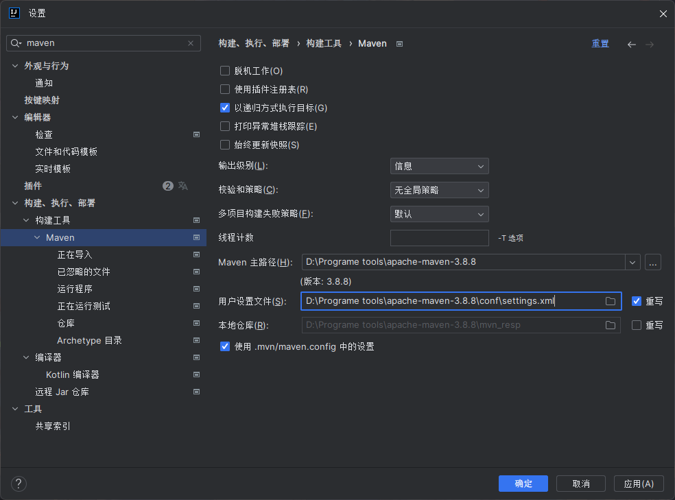

### Maven坐标

- 坐标

  - Maven中的坐标是资源的唯一标识

  - 使用坐标来定义项目或引入项目中需要的依赖

- Maven坐标主要组成
  - groupId:定义当前Maven项目隶属组织名称(通常是域名反写，例如: com.itheima)
  - artifactId:定义当前Maven项目名称(通常是模块名称,例如order service、goods service)
  - version:定义当前项目版本号版本

### 依赖管理

通过编写pom.xml文件来控制依赖信息。

Maven可以通过pom.xml自动解析项目的依赖关系，并通过Maven仓库自动下载和管理依赖。

pom.xml含有gavp四个基本属性：`groupId`、`artifactId`、`version`，`packaging`。

其中`groupId`和`artifactId`属性不会改变；`version`会随着构建过程进行改变，`packaging`属性代表maven工程的打包方式：如java项目会打包成jar包，web工程会打包成war包。


**如何导入依赖？**

1. 建立项目以来信息的集合：`denpendencies`标签。
2. 在pom.xml中按`alt`+`Fn`+`insert`，选择`dependency`，即每个依赖项 ： 每个依赖项必须包含gav三个属性。
3. 在弹出的面板中搜索对应坐标，然后双击选中对应坐标
4. 点击刷新按钮，使坐标生效


**如何知道第三方依赖的信息？**

1. maven提供的查询官网：https://mvnrepository.com
2. maven插件 maven-search  ：   使用时，只需要在工具栏中选择maven-search直接搜索即可。

对于一个第三方依赖，导入到项目中需要添加标签：xml本身类似html，通过添加`dependency`标签来添加一个依赖。


**提取版本号，统一管理**

在`properties`标签内声明一个变量，使用该变量代表版本号。

标签命名格式一般为：技术名.版本号。

其他位置的引用方式：`${变量名}`

### 依赖范围

通过设置坐标的依赖范围，可以设置对应jar包的作用范围：编译环境、测试环境、运行环境；属于**可选属性**。

```html
<dependency>
    <groupId>junit</groupId>
    <artifactId>junit</artifactId>
    <version>4.13</version>
    <scope>test</scope>		//此处即为可选属性部分
</dependency>
```

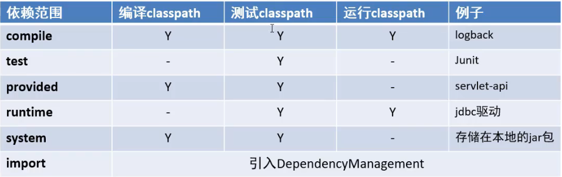

<scope>默认值：compile

### 依赖传递

对于某些第三方依赖A，其本身也有依赖B；所以在使用依赖A时就要导入依赖B，而只需要导入依赖A，maven就会自动导入依赖B。

### 依赖冲突

发现已经存在依赖（重复依赖）会终止依赖传递，避免循环依赖和重复依赖的问题。

只要发生冲突，后续依赖全部终止。

**解决原则**

第一原则：谁引用的路径长度短谁优先；

第二原则：`dependencies`声明先后顺序；

### 依赖继承与聚合

#### 依赖

子工程会继承父工程的ga属性。

父工程内使用`dependencyManagement`标签可以声明依赖且不会下载依赖，子工程会继承其版本号。

#### 聚合

聚合是指将多个项目组织到一个父级项目中，通过触发父工程的构建，统一按顺序触发子工程构建的过程。


**如何聚合**

将子工程在父工程中声明，触发父工程的构建即可。

## MyBatis

用于简化JDBC开发

### 持久层

- 负责将数据到保存到数据库的那一层代码
- JavaEE三层架构：表现层、业务层、持久层

### 框架

- 框架就是一个半成品软件，是一套可重用的、通用的、软件基础代码模型
- 在框架的基础之上构建软件编写更加高效、规范、通用、可拓展

### Mapper代理开发

1. 定义与SQL映射文件同名的Mapper接口，并且将Mapper接口和SQL映射文件放置在同一目录下
2. 设置SQL映射文件的namespace属性为Mapper接口全限定名
3. 在Mapper接口中定义方法，方法名就是SQL映射文件中sql语句的id，并保持参数类型和返回 值类型一致 

### 核心配置文件

MyBatis 的配置文件包含了会深深影响 MyBatis 行为的设置和属性信息。 配置文档的顶层结构如下：

- configuration（配置）
  - [properties（属性）](https://mybatis.net.cn/configuration.html#properties)
  - [settings（设置）](https://mybatis.net.cn/configuration.html#settings)
  - [typeAliases（类型别名）](https://mybatis.net.cn/configuration.html#typeAliases)
  - [typeHandlers（类型处理器）](https://mybatis.net.cn/configuration.html#typeHandlers)
  - [objectFactory（对象工厂）](https://mybatis.net.cn/configuration.html#objectFactory)
  - [plugins（插件）](https://mybatis.net.cn/configuration.html#plugins)
  - environments（环境配置）
    - environment（环境变量）
      - transactionManager（事务管理器）
      - dataSource（数据源）
  - [databaseIdProvider（数据库厂商标识）](https://mybatis.net.cn/configuration.html#databaseIdProvider)
  - [mappers（映射器）](https://mybatis.net.cn/configuration.html#mappers)

**注意：配置文件需保证属性的先后顺序**

### 查询

#### 查询所有&结果映射

由于数据库中字段命名和Java代码中的命名可能不一致，故可在SQL语句文件中使用resultMap

即：将SQL语句的返回结果改为resultMap格式，在SQL语句上定义resultMap标签，在resultMap中写明result标签

再在result标签中写明列标签和属性，如：

```html
<resultMap id="ResultMap" type="返回值对应的类">
	<result column="数据库中字段" property="类中属性" />
</resultMap>
```

#### 查看详情

参数占位符

- `#{}` ： 会将其替换为？. 为了防止SQL注入
- `${}`  : 拼SQL。会存在SQL注入问题

参数传递时使用`#{}`，表名或列名不固定的情况下使用`${}`

例如

```html
<select id="selectById" resultMap="userResultMap">
    select *
    from tb_user where if = #{id};
</select>
```

传入SQL语句时，由于SQL语句写在XML文件，所以对于 `<` 而言是有报错的

所以，对于这些特殊字符的处理有以下两种方式

- 转义字符：将特殊字符进行转义
- CDATA区：输入CD自动创建CDATA区，在标签里写入特殊字符。

#### 条件查询

参数接收

1. 散装参数：如果方法中有多个参数，需要使用@Param("SQL参数占位符名称")
2. 对象参数：对象的属性名称要和参数占位符名称一致
3. map集合参数

##### 散装参数

接口中写入函数

```java
List<brand> selectByCondition(@Param("status")int status,@Param("companyName")String compantName,@Param("brandName")String brandName)
```

返回值类型为brand，每个参数之前标注注释@Param，后面跟随标签中SQL语句占位符的名称，然后写入默认传入的参数。

##### 对象参数

新建对象然后给该对象指定参数，传参只需传入该对象即可。

##### map集合参数

作为双列集合，使用put方法指定其键值对，随后传入map对象即可。

以上方法的缺陷是必须传入全部参数，缺少任意一个参数均会返回NULL。所以需要动态查询

#### 动态条件查询

以上方法对于查询时有缺点，解决方法为动态查询

##### 多条件动态查询

使用if标签和where标签，如

```html
<select id="selectByCondition" resultMap="brandResuleMap">
    select *
    from tb_user
    <where>
    	<if test="status != null">
            status = #{status}
        </if>
        <if test="company_name != null and company_name != '' ">
            company_name like #{company_name}
        </if>
        <if test="brandName != null and brandName != '' ">
            brandName like #{brandName}
        </if>
    </where>
</select>
```

注：对于xml语句来说，使用`and`表示并且。

##### 单条件查询

对于xml中的标签而言，choose相当于switch，when相当于case，otherwise相当于default。

使用where标签，则会自动纠错：比如在choose选择下无otherwise的情况，传入空参将报错。而使用where标签则会在此情况下将where省略。

### 添加

添加功能的标签为insert。如：

```html
<insert id="add">
    insert into tb_brand (brand_name,company_name,ordered,description,status)
    value (#{brandName},#{companyName},#{prderded},#{description},#{status});
</insert>
```

尽管调用了SQL标签，而且在终端显示成功添加了数据，但是在数据库中并没有数据的更新，原因在于：没有开启自动提交，代表事物的提交默认为手动，所以事物会回滚，即并没有添加数据。解决办法为：

- 设置自动提交事务：在获取Mapper接口的代理对象时，对SqlSession对象的getMapper方法传入参数true，即设置autocommit参数为true，以此开启自动提交

- 在执行完SQL语句的方法后添加提交事务的代码：即对SqlSession对象使用提交方法，如`sqlSession.commit();`

#### 返回添加数据的主键

对于插入到数据库的数据，有时需要立即获取它的主键（ID），此时需要给SQL标签添加以下内容，即可给返回的对象中添加刚插入数据的主键，随后调用对象的方法获取主键即可（一般为ID）。

```html
<insert useGeneratedKeys="true" keyProperty="id">
```

### 修改

#### 修改全部字段

HTML标签为`update`，如：

```html
<update id="update">
	update tb_user
    set
    	brand_name = #{brandName},
    	company_name = #{companyName},
    	ordered = #{ordered},
    	description = #{description},
    	status = #{status}
    where id = #{id};
</update>
```

使用该标签的方法之后，会有一个返回值：代表受影响的行数。

#### 动态修改

 解决方法：使用`set`标签替代set，内部需要修改的数据装入`if`标签即可。如：

```html
<update id="update">
	update tb_user
    <set>
    	<if test="brandName != null and brandName != ''">
        	brand_name = #{brandName},
        </if>
        <if test="company_name != null and company_name != ''">
        	company_name = #{companyName},
        </if>
        <if test="ordered != null">
        	ordered = #{ordered},
        </if>
        <if test="description != null and description != ''">
        	description = #{description},
        </if>
        <if test="status != null">
        	status = #{status}
        </if>
    </set>	
    where id = #{id};
</update>                        
```

### 删除

#### 单独删除

使用`delete`标签，如：

```html
<delete id="deleteById">
	delect from tb_brand where id=#{id};
</delete>
```

#### 批量删除

 对于批量删除，其需要同时删除多个ID，但因为占位符的个数所以很难统一，故使用XML标签中的遍历方法，如下：

```html
<delete id="deleteById">
	delect from tb_brand
    where id in
    <foreach collection="array" item="id" separator="," open="(" close=")">
    	#{id}
    </foreach>
</delete>
```

其中：`collection`标签代表了接收的数据的类型，在传递数组时，mybatis会将数组参数封装为一个Map集合，所以可默认写`array`。`item`标签代表传入数组的各个元素的名称，也就是将要填入下方标签的占位符。`separator`代表分隔符，`open`和`close`标签代表`foreach`标签产生的数据用什么包裹，因原始语句为：

```html
delect from tb_brand where id=(id,id,id);
```

所以分隔符使用逗号，起始符和结尾符使用括号即可。

注：可以使用@Param注解改变map集合的默认key的名称，这样就可以给`collection`标签填写数组的名称。

### 参数传递

传递多个参数的时候，Mybatis会将其封装为Map集合，默认名称为`arg`和param，arg从0开始，param从1开始。所以使用`@Param`注解的作用是替代Map集合中默认的arg键名

传递单个参数的时候：

- 传递POJO类型、Map集合、其他类型时可直接使用。
- 传递Collection、List、Array时会将其封装为Map集合。

### 注解开发

一些简单的功能可以使用注解开发来替代，如下：

```java
@Select("select * from tb_user where id= #{id}")
public User selectById(int id);
```

##  HTTP

### 请求

#### 数据格式

1. 请求行：请求数据的第一行。其中GET表示请求方式，/表示请求资源路径，HTTP/1.1表示协议版本。
2. 请求头：第二行开始，格式为key:value形式。
3. 请求体：POST请求的最后一部分，存放请求参数

例如：

GET请求的请求数据：

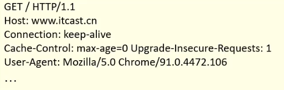

POST请求的请求数据：

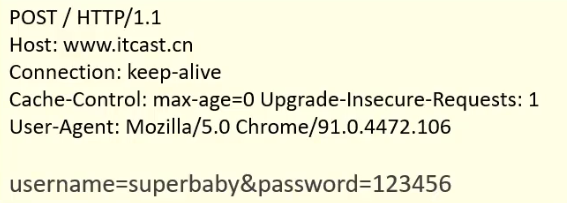

#### 常见的HTTP请求头

- HOST：表示请求的主机名。
- User-Agent：浏览器版本。
- Accept：表示浏览器能接受的资源类型，如text/\*，image/\*，或者\*/\*表示所有。
- Accept-Language：表示浏览器偏好的语言，服务器可以据此返回不同语言的网页。
- Accept-Encoding：表示浏览器可以支持的压缩类型，例如gzip，deflate等。

#### GET和POST请求区别

1. GET请求的请求参数在请求行中，没有请求体；POST请求的请求参数在请求体中。
2. GET请求的请求参数有大小限制，POST没有。

### 响应

#### 数据格式

1. 响应行：响应数据的第一行。其中HTTP/1.1表示协议版本，200表示响应状态码，OK表示状态码描述。
2. 响应头：第二行开始，格式为key:value形式。
3. 响应体：最后一部分，存放响应数据。

例如：

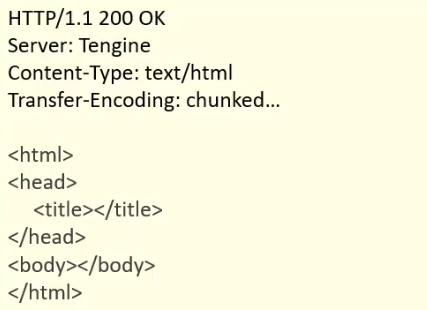

#### 常见的HTTP响应头

- Content-Type：表示该响应内容的类型，例如text/html，image/jpeg。
- Content-Length：表示该响应内容的长度（字节数）；
- Content-Encoding：表示该响应压缩算法，例如gzip；
- Cache-Control：只是客户端应如何缓存，例如max-age=300表示可以最多缓存300秒

## Tomcat

Tomcat是一个轻量级的Web服务器，支持Servlet/JSP少量JavaEE规范，也称Web容器，Servlet容器

### 配置

Tomcat默认的输出信息以UTF-8格式为准，在Windows下会出现乱码；解决办法为：在conf目录下的logging.properties文件中将logging.ConsoleHandler.encoding的值改为GBK。

对于启动时出现闪退的问题，是由于java环境没有配置。

#### 修改端口号

在conf/server.xml目录下将

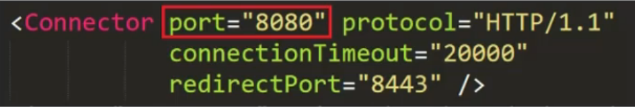

port修改为想要的端口号即可。

### Web项目结构

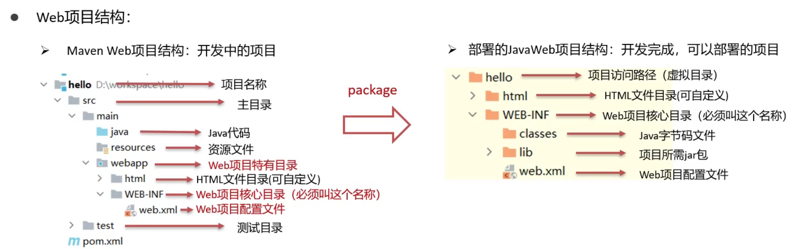

### 创建Maven Web项目

#### 使用骨架

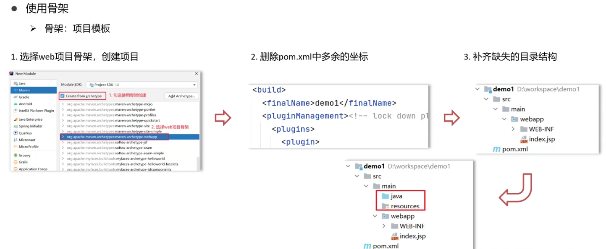

#### 不使用骨架

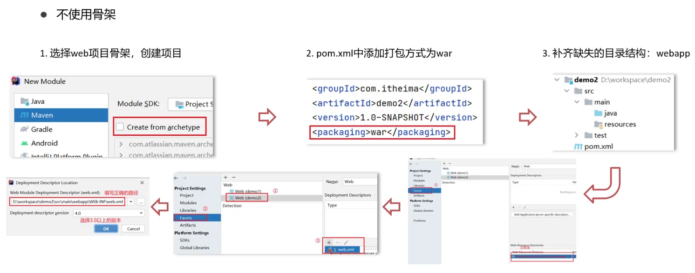

### IDEA中使用Tomcat

#### 集成本地Tomcat

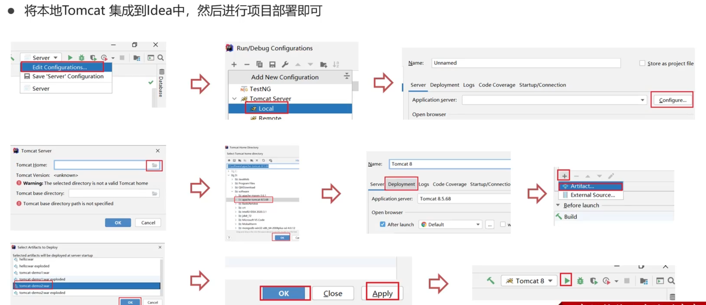

#### Tomcat Maven插件

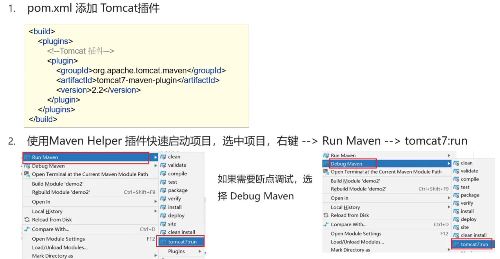

## Servlet

### 入门

1. 创建Web项目，导入Servlet依赖坐标

   ```html
   <dependency>
   	<grounId>javax.servlet</grounId>
       <artifactId>javax.servlet-api</artifactId>
       <version>3.1.0</version>
       <scope>provided</scope>
   </dependency>
   ```

2. 创建：定义一个类，实现servlet接口，并重写接口中所有方法，并在service方法中输入一句话

   ```java
   public class ServletDemo1 implements Servlet{
       public void service(){}
   }
   ```

3. 配置：在类上使用@WebServlet注解，配置该Servlet的访问路径

   ```java
   @WebServlet("/demo1")
   public class ServletDemo1 implements Servlet{}
   ```

4.  访问：启动Tomcat，浏览器输入URL访问该Servlet

   ```html
   http://localhost/web-demo/demo1
   ```


### 方法

- 初始化方法，在Servlet被创建的时候执行一次。

  ```java
  void init(ServletConfig config)
  ```

- 提供服务方法，每次Servlet被访问，都会调用该方法

  ```java
  void service(ServletRequest req,ServletResponse res)
  ```

- 销毁方法，当Servlet被销毁时，调用该方法。在内存释放或服务器关闭时销毁Servlet

  ```java
  void destory()
  ```

- 获取ServletConfig对象

  ```java
  ServletConfig getServletConfig()
  ```

- 获取Servlet信息

  ```java
  String getServletInfo()
  ```

### UrlPattern配置

#### 精确匹配

- 配置路径：`@WebServlet("/user/select")`
- 访问路径：`localhost/web-demo/user/select`

#### 目录匹配

- 配置路径：`@WebServlet("/user/*")`
- 访问路径：`localhost/web-demo/user/aaa`，`localhost/web-demo/user/bbb`

#### 扩展名匹配

- 配置路径：`@WebServlet("/user/*.do")`
- 访问路径：`localhost/web-demo/user/aaa.do`，`localhost/web-demo/user/bbb.do`

#### 任意匹配

- 配置路径：`@WebServlet("/*")`，`@WebServlet("/")`
- 访问路径：`localhost/web-demo/aaa`，`localhost/web-demo/bbb`

注意：

当项目中的Servlet配置了"/"，会覆盖掉tomcat中的DefaultServlet，当其他的url-pattern都匹配不上时都会走这个Servlet

当项目中配置了"/*"，意味着匹配任意访问路径

#### XML配置方式编写Servlet

先编写Servlet标签的全类名，再编写访问路径

## Request和Response

### Request

#### 获取请求数据

请求数据分为三部分：

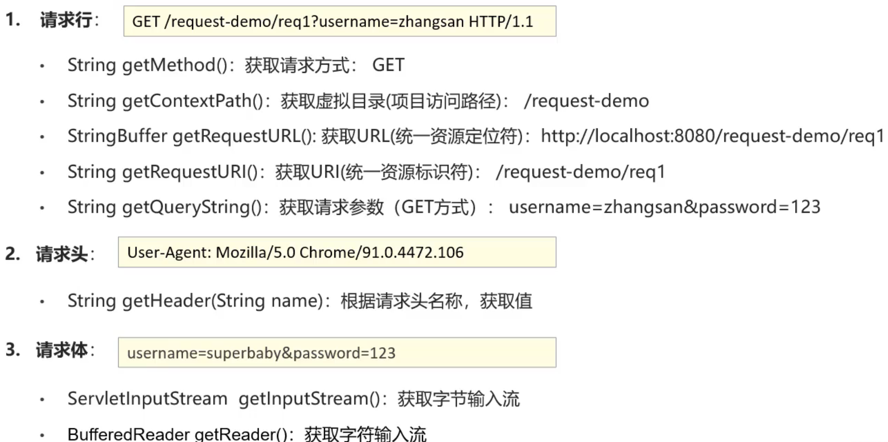

#### 通用方式获取请求参数

GET方式：

```java
String getQueryString()
```

Post方式：

```java
BufferedReader getReader()
```

获取所有参数Map集合：

```java
Map<String,String[]> getParameterMap()
```

根据名称获取参数值（数组）：

```java
String[] getParameterValues(String name)
```

根据名称获取参数值（单个值）：

```java
String getParameter(String name)
```

#### 请求参数中文乱码

POST：

```java
request.setCharacterEncoding("UTF-8");	//设置字符输入流的编码 
```

通用方式：

```java
new String(username.getBytes("ISO-8859-1"),"UTF-8");	//先解码，再编码
```

URL编码实现方式

编码：

```java
URLEncoder.encode(str,"utf-8");
```

解码：

```java
URLDecoder.decode(str,"ISO-8859-1");
```

#### 请求转发

实现方法：

```java
req.getRequestDispatcher("资源B路径").forward(req,resp);
```

请求转发资源间共享数据：使用Request对象

```java
void setAttribute(String name,Object o)	//存储数据到request域中
Object getAttribute(String name)	//根据key，获取值
void remove Attribute(String name)	//根据key，删除该键值对
```

- 浏览器地址栏路径不发生变化
- 只能转发到当前服务器的内部资源
- 一次请求，可以再转发的资源间使用request共享数据

### Response

  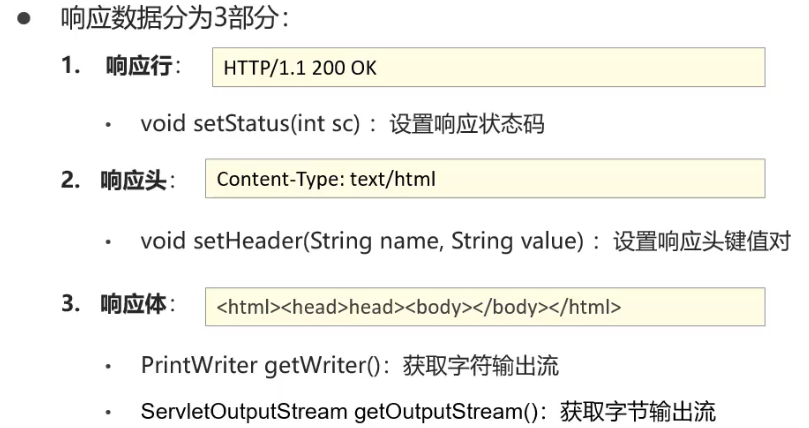   

重定向：

```java
resp.setStatus(302);
resp.setHeader("location","资源B的路径");
```

 ```java
 resp.sendRedirect("资源B的路径")
 ```

重定向特点：

- 浏览器地址栏路径发生变化
- 可以重定向到任意位置的资源（服务器内部、外部均可）
- 两次请求，不能再多个资源使用使用request共享数据

#### 路径问题

- 浏览器使用：需要加虚拟目录(项目访问路径)
- 服务端使用：不需要加虚拟目录

#### Response响应字符数据

- 使用：

  1. 通过Response对象获取字符输出流

     ```java
     PrintWriter writer = resp.getWriter();
     ```

  1. 写数据

     ```java
     writer.write("aaa");
     ```

- 注意：

  - 该留不需要关闭，随着响应结束，response对象销毁，由服务器关闭

  - 中文数据乱码：原因通过Response获取的字符输出默认编码：ISO-8859-1

    ```java
    resp.setContentType("text/html;charset=utf-8");
    ```

#### Response响应字节数据

- 使用

  1. 通过Response对象获取字符输出流

     ```java
     ServletOutputStream outputStream = resp.getOutputStream();
     ```

  1. 写数据

     ```java
     outputStream.write(字节数据);
     ```

- IOUtils工具类使用

  1. 导入坐标

     ```html
     <dependency>
     	<groupId>commons-io</groupId>
         <artifactId>commons-io</artifactId>
         <version>2.6</version>
     </dependency>
     ```

  1. 使用

     ```java
     IOUtils.copy(输入流，输出流);
     ```


## MVC模式和三层架构

### MVC

MVC是一种分层开发的模式，其中：

- M：Model，业务模型，处理业务
- V：View，视图，页面展示
- C：Controller，控制器，处理请求，调用模型和视图

### 三层架构

- 数据访问层：对数据库的CRUD基本操作
- 业务逻辑层：对业务逻辑进行封装，组合数据访问层层中基本功能，形成复杂的业务逻辑功能
- 表现层：接受请求，封装数据，调用业务逻辑层，响应数据

## 会话跟踪

- 会话：用户打开浏览器，访问web服务器的资源，会话建立，直到有一方断开连接，会话结束，在一次会话中可以包含多次请求和响应。
- 会话跟踪：一种维护浏览器状态的方法，服务器需要识别多次请求是否来自于统一浏览器，以便在同一次会话的多次请求间共享数据。
- HTTP协议是无状态的，每次浏览器向服务器请求时，服务器都会将该请求视为新的请求，因此我们需要会话跟踪技术来实现会话内数据共享。
- 实现方式：
  1. 客服端会话跟踪技术：Cookie
  2. 服务端会话跟踪技术：Session

### Cookie

客户端会话技术，将数据保存到客户端，以后每次请求都携带Cookie数据进行访问

#### 基本使用

##### 发送Cookie

1. 创建Cookie对象，设置数据

   ```java
   Cookie cookie = new Cookie("key","value");
   ```

2. 发送Cookie到客户端：使用response对象

   ```java
   response.addCookie(cookie);
   ```

##### 获取Cookie

1. 获取客户端携带的所有Cookie，使用request对象

   ```java
   Cookie[] cookies = request.getCookie();
   ```

2. 遍历数组，获取每一个Cookie对象：for

3. 使用Cookie对象方法获取数据

    ```java
    cookie.getName();
    ```

   ```java
   cookie.getValue();
   ```

#### 原理

#### 使用细节

##### Cookie存活时间

- 默认情况下，Cookie存储在浏览器内存中，当浏览器关闭，内存释放则Cookie被销毁
- setMaxAge(int second)：设置Cookie存活时间
  1. 正数：将Cookie写入浏览器所在电脑的硬盘，持久化存储。到时间自动删除
  2. 负数：默认值，Cookie在当前浏览器内存中，当浏览器关闭，则Cookie被销毁
  3. 零：删除对应Cookie 

##### Cookie存储中文

- Cookie不能直接存储中文
- 如需要储存，则需要进行转码：URL编码

### Session

服务端会话跟踪技术：将数据保存到服务端 

JavaEE提供HttpSession接口，来实现一次会话的多次请求间数据共享内容

#### 基本使用

1. 获取Session对象

   ```java
   HttpSesssion session = request.getSession();
   ```

2. Session对象功能

   ```java
   void setAttribute(String name,Object o);	存储数据到session域中
   Object getAttribute(String name):	根据key，获取值
   void removeAttribute(String name):	根据key，删除该键值对
   ```

#### 原理

Session是基于Cookie实现的

#### 使用细节

- Session钝化、活化：

  - 服务器重启后，Session中的数据仍然存在
  - 钝化：在服务器正常关闭后，Tomcat会自动将Session数据写入硬盘文件中
  - 活化：再次启动服务器后，从文件中加载数据到Session中

- Session销毁：

  - 默认情况下，无操作，30分钟后自动销毁

    ```html
    <session-config>
    	<session-timeout>30</session-timeout>
    </session-config>
    ```

  - 调用Session对象的`invalidate()`方法

#### 小结

- Cookie和Session都是来完成一次会话内多次请求间数据共享的
- 区别
  - 储存位置：Cookie是将数据存储在客户端，Session将数据存储在客户端
  - 安全性：Cookie不安全，Session安全
  - 数据大小：Cookie最大3KB，Session无大小限制
  - 储存时间：Cookie可以长期储存，Session默认30分钟
  - 服务器性能：Cookie不占服务器资源，Session占用服务器资源

## Filter

Filter表示过滤器，是JavaWeb三大组件（Servlet、Filter、Listener）之一。

过滤器可以把对资源的请求拦截下来，从而实现一些特殊的处理。

过滤器一般完成一些通用的操作，比如：权限控制、统一编码处理、敏感字符处理等等。

### 基本使用

1. 定义类，实现Filter接口，并重写其所有方法

   ```java
   public class FilterDemo implements Filter{
       public void init(FilterConfig filterConfig);
       public void doFilter(ServletRequest request);
       public void destory(){}
   }
   ```

2. 配置Filter拦截资源的路径：在类上定义`@WebFilter`注解

   ```java\
   @WebFilter("/*")
   public class FilterDemo implements Filter{}
   ```

3. 在doFilter方法中输出一句话，并放行

   ```java
   public void deFilter(ServletRequest request,ServletResponse response){
       System.out.println("filter被执行了...");
       //放行
       chain.doFilter(request,response);
   }
   ```

### 拦截路径配置

```java
@WebFilter("/*")
public class FilterDemo
```

- 拦截具体的资源：/index.jsp：只有访问index.jsp时才会被拦截
- 目录拦截：/user/*：访问/user下的所有资源，都会被拦截
- 后缀名拦截：*.jsp：访问后缀名为jsp的资源，都会被拦截
- 拦截所有：/*：访问所有的资源，都会被拦截

### 过滤器链

一个Web应用，可以配置多个过滤器，这多个过滤器成为过滤器链

注解配置的Filter，优先级按照过滤器类名（字符串）的自然排序

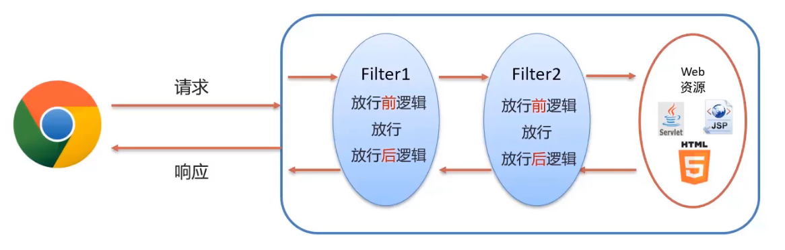

## AJAX

异步的JavaScript和XML

作用：

1. 与服务器进行数据交换：通过AJAX可以给服务器发送请求，并获取服务器响应的数据
2. 异步交互：可以在不重新加载整个页面的情况下，与服务器交换数据并更新部分网页的技术，如：搜索联想，用户名是否可用校验等

### 使用

1. 编写AjaxServlet，并使用response输出字符串

2. 创建XMLHttpRequest对象：用于和服务器交换数据

3. 向服务器发送请求

   ```html
   xmlhttp.open("GET","URL");
   xmlhttp.send();	//发送请求
   ```

4. 获取服务器响应数据

   ```html
   xmlhttp.onereadystatechange = function(){
   	if(xmlhttp.readyState == 4 && xmlhttp.status == 200){
   		alert(xmlhttp.responseText);
   	}
   }
   ```

## Axios异步框架

### 使用

1. 引入axios的js文件

   ```html
   <script src="js/axios-0.18.0.js"></script>
   ```

2. 使用sxios发送请求，并获取响应结果

   ```html
   axios({
   	method:"get",	
   	url:"www.baidu.com"
   }).then(function(resp){
   	alert(resp.data);
   });
   ```

   ```html
   axios({
   	method:"get",	
   	url:"www.baidu.com",
   	data:"username=zhangsan"
   }).then(function(resp){
   	alert(resp.data);
   });
   ```

### 请求方式别名

1. 发送get请求

   ```html
   axios.get("url")
   	.then(function(resp){
   		alert(resp.data);
   })
   ```

2. 发送post请求

   ```html
   axios.post("url","参数")
   	.then(function(resp){
   		alert(resp.data);
   })
   ```

## JSON

### 基础语法

 标准格式

```htnml
var 变量名 = {
	"key1":value1,
	"key2":value2,
	...
};
```

value的数据类型为：

- 数字（整数或浮点数）
- 字符串（在双括号中）
- 逻辑值（true或false）
- 数组（在方括号中）
- 对象（在花括号中）
- null

示例

```html
var json = {
	"name":"zhangsan",
	"age":23,
	"addr":["北京","上海","西安"]
};
```

### 获取数据

标准格式

```html
变量名.key
```

示例

```html
json.name
```

### JSON数据和Java对象转换

Fastjson：目前最快的JSON库，可以实现Java对象和HSON字符串的相互转换。

使用：

1. 导入坐标

   ```html
   <dependency>
   	<groupId>com.alibaba</groupId>
       <artifactId>fastjson</artifactId>
       <version>1.2.62</version>
   </dependency>
   ```

2. Java对象转JSON

   ```html
   String jsonStr = JSON.toJSONString(obj);
   ```

3. JSON字符串转Java对象

   ```html
   User user = JSON.parseObject(jsonStr,User.class);
   ```
